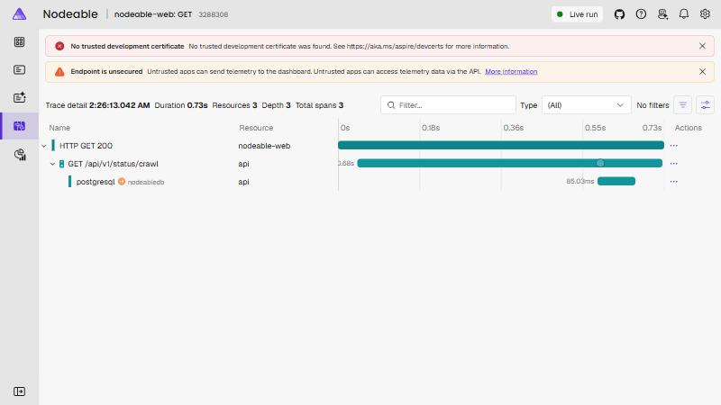

# LG-01: Foundations

> **Draft status.** Sections 1 to 4 were drafted from the `LEARN:` anchors and the milestone's code. Sections 5 to 11 are outlines with prompts: write them in your own words, because writing them is where the learning happens. Remove this note when the guide is finished.

## 1. What was built

**Requirements delivered:** NFR-OBS-01, NFR-REL-01 (foundation), NFR-REL-02, NFR-SEC-01, NFR-SEC-04, NFR-A11Y-01, NFR-A11Y-02, NFR-PERF-04, FR-ABOUT-01 (partial). The data model also lays the foundation for FR-GRAPH-01, FR-GRAPH-03, FR-HUB-01, FR-HUB-02 and FR-SEARCH-01.

Milestone M1 delivers no user-facing music feature. It delivers the platform every later feature stands on. One command (`dotnet run --project src/Nodeable.AppHost`) starts PostgreSQL, Redis, an Api, a Worker and a React app, all orchestrated by Aspire. The database schema from spec section 8 exists as an EF Core migration. The web app has a dark-first studio theme, routing and an About page that shows the live queue depth read from the database through the Api, using TypeScript types generated from the Api's OpenAPI document. Most importantly, one click in the browser now appears as a single trace in the Aspire dashboard, running from the browser through the Api to PostgreSQL. GitHub Actions is set up to build, test, lint and audit both halves of the project on every pull request, and to build these guides as PDFs.

## 2. Architecture slice

Only the components M1 touched are shown. The Worker is a heartbeat for now; the crawl queue consumer and Redis usage arrive in M2.

```text
Browser (React, MUI, TanStack Query)
   │ /api/...                          /otlp/v1/traces   (SDK loaded after first paint)
   ▼                                        │
Vite dev server: same-origin proxy ─────────┼───────────► Aspire dashboard (OTLP)
   │ /api                                                     ▲        ▲
   ▼                                                          │        │
Api (Minimal API, EF Core) ──► PostgreSQL            telemetry │        │ telemetry
   └─────────────────────────────────────────────────────────┘        │
Worker (heartbeat span and log in M1) ─────────────────────────────────┘

AppHost: starts and wires all of the above, plus Redis (not used until M2)
```

One request, from the About page to the database:

1. The browser requests `/api/v1/status/crawl` on its own origin. The tracing instrumentation adds a `traceparent` header.
2. Vite proxies the request to the Api, using the address Aspire injected into its environment.
3. The Api's server span continues the browser's trace and runs the endpoint handler.
4. The handler counts pending rows in `crawl_jobs` through EF Core; Npgsql records a `postgresql` span.
5. The response is typed by the generated OpenAPI contract, and TanStack Query puts it in the cache.
6. The browser's batched spans go to `/otlp/v1/traces`, which Vite forwards to the dashboard, where all three spans appear as one trace.

## 3. Code map

Generated with `tools/learning/collect-anchors LG-01`. Links point to the commit above, so they never go stale.
Do not edit between the two markers: `tools/learning/build` replaces the table with a fresh one pinned to the release commit every time the PDF is built.

<!-- code-map:start -->

_The code map is generated when the guide is built, and written into this file by `tools/learning/build LG-01 --write` when the guide is finalised._

<!-- code-map:end -->

## 4. Annotated walkthrough

Five anchors were chosen because each shows a decision that is easy to get wrong, rather than a framework feature that is easy to look up. The code map lists all 15 anchors that stay in the code, so the other 10 are one click away; the 41 anchors that explained basic idioms moved into section 5.

### 4.1 `service-defaults`: one place for telemetry, health checks and resilience

```csharp
public static TBuilder AddServiceDefaults<TBuilder>(this TBuilder builder)
    where TBuilder : IHostApplicationBuilder
{
    builder.ConfigureOpenTelemetry();
    builder.AddDefaultHealthChecks();

    builder.Services.AddServiceDiscovery();

    builder.Services.ConfigureHttpClientDefaults(http =>
    {
        http.AddStandardResilienceHandler();
        http.AddServiceDiscovery();
    });

    return builder;
}
```

- **`this TBuilder builder`:** an extension method. It appears on the builder itself, so `builder.AddServiceDefaults()` reads like a method the builder always had.
- **`where TBuilder : IHostApplicationBuilder`:** the same constraint accepts the web builder (Api) and the generic host builder (Worker), and returning `TBuilder` keeps calls chainable. Without the generic, the Worker could not share this.
- **`ConfigureOpenTelemetry` and `AddDefaultHealthChecks`:** logs, metrics and traces are configured here once, so a new service gets them by calling one method.
- **`ConfigureHttpClientDefaults`:** every `HttpClient` created through dependency injection gets a retry, timeout and circuit-breaker pipeline. In M2 the MusicBrainz client replaces it with the spec's own policy (NFR-RATE-03).
- **What would break:** if the Api and Worker each configured telemetry themselves, the setups would drift, and one of them would eventually be missing traces.

### 4.2 `service-wiring`: the whole system as typed C#

```csharp
var api = builder.AddProject<Projects.Nodeable_Api>("api")
    .WithReference(nodeableDb)
    .WaitFor(nodeableDb)
    .WithHttpHealthCheck("/health");

builder.AddViteApp("web", "../../web")
    .WithReference(api)
    .WaitFor(api);

builder.AddProject<Projects.Nodeable_Worker>("worker")
    .WithReference(nodeableDb)
    .WithReference(redis)
    .WaitFor(api)
    .WaitFor(redis);
```

- **`Projects.Nodeable_Api`:** a type Aspire generates from the project reference, so renaming or deleting the Api is a compile error here, not a runtime surprise.
- **`WithReference(nodeableDb)`:** injects the connection string as configuration (`ConnectionStrings__nodeabledb`). The service never contains a password or host name.
- **`WaitFor`:** holds a service back until its dependency is healthy. The Worker waits for the Api because the Api applies the database migrations in Development (decision 0003); without it the two would race.
- **`WithReference(api)` on the web app:** this is how Vite learns the Api's address (`services__api__http__0`), which `vite.config.ts` uses as its proxy target (decision 0004).

### 4.3 `partial-unique-index` and `idempotent-upsert`: rules the database enforces

```csharp
// crawl_jobs: the same fetch is never queued twice while it is outstanding
builder.HasIndex(j => new { j.Kind, j.TargetMbid })
    .IsUnique()
    .HasFilter("status IN ('pending', 'running')");

// credits: inserting the same credit again conflicts instead of duplicating
builder.HasIndex(c => new { c.PersonMbid, c.SubjectType, c.SubjectMbid, c.Role, c.Detail })
    .IsUnique();
```

- **`.HasFilter("status IN ('pending', 'running')")`:** the uniqueness only applies to outstanding jobs. Finished jobs stay as history, and the same recording can be fetched again later (for example a 30-day cache refresh), which a plain unique index would forbid.
- **Why a database rule and not an `if` in C#:** two Api instances can check "is it queued?" at the same moment and both say no. A unique index cannot be raced (NFR-REL-01).
- **The `credits` index and `Detail`:** a re-crawl can then use `INSERT ... ON CONFLICT DO NOTHING`. It only works because `Detail` is never null: PostgreSQL treats NULLs as distinct in a unique index, so a null detail would let duplicates in.
- **How it is tested:** `NFR_REL_01_crawl_job_cannot_be_queued_twice_while_pending_but_can_be_again_once_done` and `FR_GRAPH_03_duplicate_credit_is_rejected_even_when_detail_is_empty` run against a real PostgreSQL container.

### 4.4 `late-bound-fetch`: a bug that makes no noise

```ts
export function createApiClient(baseUrl: string = window.location.origin) {
  return createClient<paths>({
    baseUrl,
    fetch: (request) => globalThis.fetch(request),
  })
}
```

- **`createClient<paths>`:** generic over the types generated from the Api's OpenAPI document, so a wrong path or a misread response field is a compile error.
- **`fetch: (request) => globalThis.fetch(request)`:** `openapi-fetch` copies `globalThis.fetch` when the client is created. Tracing replaces `globalThis.fetch` *after first paint* (decision 0002). A client created earlier would keep calling the original, and its requests would carry no `traceparent` header, with no error anywhere.
- **What would break:** the trace would silently start at the Api instead of the browser. `NFR_OBS_01 sends a traceparent header on Api requests made by a client created before tracing started` exists to fail in that case, and does when the line is removed.
- **The general lesson:** code that patches a global (here `fetch`) only affects callers that look the global up at call time.

### 4.5 `otel-web-sdk`: the same three parts as the server

```ts
export function startTracing(exporter: SpanExporter = new OTLPTraceExporter({ url: OTLP_TRACES_URL })): Tracing {
  const provider = new WebTracerProvider({
    resource: resourceFromAttributes({ 'service.name': 'nodeable-web' }),
    spanProcessors: [new BatchSpanProcessor(exporter)],
  })
  provider.register()

  const unregisterInstrumentations = registerInstrumentations({
    tracerProvider: provider,
    instrumentations: [new FetchInstrumentation({ ignoreUrls: [/\/otlp\//] })],
  })
  // ...
}
```

- **`WebTracerProvider` with `service.name`:** the provider creates spans, and the resource name is what the dashboard shows as the service (`nodeable-web`).
- **`BatchSpanProcessor`:** buffers spans and sends them together, so the browser does not make one network request per span.
- **`FetchInstrumentation`:** creates a span for every `fetch` and adds the W3C `traceparent` header, which is what makes the Api's span a child of the browser's.
- **`ignoreUrls: [/\/otlp\//]`:** the exporter's own POSTs must not be traced, or every export would create a span that needs exporting.
- **`/otlp/v1/traces`, a same-origin URL:** the browser never learns where telemetry is collected, and no CORS rules are needed (decision 0004).

## 5. New concepts from a JavaScript point of view

Write one row per concept, in your own words. The *Hint* in the last column is the explanation that used to sit in the code as a `LEARN:` anchor, kept here so nothing is lost; rewrite it as the key difference you would give in an interview.

### C# and .NET language idioms

| Concept | In JavaScript / Node.js | In this code | Key difference |
| --- | --- | --- | --- |
| Nullable reference types | | `Directory.Build.props` | _Hint (from the `nullable` anchor):_ Nullable reference types make the compiler track "can this be null?" in the type system, like TypeScript strictNullChecks. string means never null; string? means maybe null. |
| Top-level statements | | `src/Nodeable.Api/Program.cs` | _Hint (from the `top-level-statements` anchor):_ No Main method or class needed: the compiler wraps these statements in one, so this reads like a Node entry file (const app = express(); app.listen()) |
| The builder: configure, `Build()`, `Run()` | | `src/Nodeable.Api/Program.cs` | _Hint (from the `builder-pattern` anchor):_ Startup has two phases: register services on the builder, then Build() freezes the container and returns the app used to configure the request pipeline |
| Extension methods and generic constraints | | `src/Nodeable.ServiceDefaults/Extensions.cs` | _Hint (from the `extension-method` anchor):_ "this TBuilder builder" makes this a static method that appears on the builder itself (builder.AddServiceDefaults()); the "where" clause works like a TypeScript "extends" generic constraint |
| Records as data carriers | | `src/Nodeable.Api/Endpoints/CrawlStatusResponse.cs` | _Hint (from the `record-dto` anchor):_ A positional record is a one-line immutable data class with value equality; the compiler writes the constructor, properties and ToString, and the framework serialises it straight to JSON, like returning a plain object literal from an Express handler |
| Class versus record for EF entities | | `src/Nodeable.Domain/Entities/Recording.cs` | _Hint (from the `entity-class` anchor):_ Entities are plain classes, not records: EF Core tracks each row as one object instance and mutates it, while a record compares by value and is meant to be immutable |
| `init`, `set` and `required` | | `src/Nodeable.Domain/Entities/Recording.cs` | _Hint (from the `init-vs-set` anchor):_ "init" can only be assigned when the object is created (the key never changes); "set" stays writable because a re-crawl updates the other columns. "required" makes the compiler reject any new Recording that omits the property |
| `CancellationToken` | | `src/Nodeable.Worker/CrawlWorker.cs` | _Hint (from the `cancellation-token` anchor):_ stoppingToken is how the host says "shut down now"; it is passed explicitly into every await, much like an AbortSignal in fetch, and nothing cancels unless you thread it through |
| `Activity`, `ActivitySource` and `?.` | | `src/Nodeable.Worker/CrawlWorker.cs` | _Hint (from the `activity-span` anchor):_ StartActivity creates a trace span (an Activity in .NET); it returns null when no exporter is listening, hence the "?." null-conditional below, which behaves like optional chaining in JavaScript |
| Source-generated logging (`[LoggerMessage]`) | | `src/Nodeable.Worker/CrawlWorker.cs` | _Hint (from the `logger-message` anchor):_ [LoggerMessage] is a source generator: you declare a partial method and the compiler writes its body at build time, so logging allocates nothing when the level is off; {IntervalSeconds} stays a named, searchable field on the log record instead of being baked into a string |
| Dependency injection lifetimes and scopes | | `src/Nodeable.Api/Program.cs` | _Hint (from the `service-scope` anchor):_ A DbContext is registered per request ("scoped"), and startup code has no request, so it opens its own scope; resolving a scoped service outside one is an error |

### Build and project tooling

| Concept | In JavaScript / Node.js | In this code | Key difference |
| --- | --- | --- | --- |
| `Directory.Build.props` | | `Directory.Build.props` | _Hint (from the `build-props` anchor):_ Directory.Build.props is picked up automatically by every .csproj below this folder, like a shared base config (think a root tsconfig "extends" or .eslintrc) that you never have to import. |
| Central package management | | `Directory.Packages.props` | _Hint (from the `central-packages` anchor):_ Central Package Management: every NuGet version lives in this one file. A .csproj lists &lt;PackageReference Include="X" /&gt; with no version. It works like npm workspaces plus a single shared lockfile policy. |
| Vite and Vitest sharing one config | | `web/vite.config.ts` | _Hint (from the `vite-vitest-config` anchor):_ Vitest reads the same vite.config.ts as the dev server, so tests use the same plugins and module resolution as the app; importing defineConfig from 'vitest/config' just adds the typed `test` block |
| ESLint flat config | | `web/eslint.config.js` | _Hint (from the `eslint-flat-config` anchor):_ ESLint's "flat config" is a plain array of config objects; later entries override earlier ones, and each entry can be limited to certain files, so the whole setup reads top to bottom like a middleware chain |

### Web framework patterns

| Concept | In JavaScript / Node.js | In this code | Key difference |
| --- | --- | --- | --- |
| Route groups | | `src/Nodeable.Api/Endpoints/StatusEndpoints.cs` | _Hint (from the `route-group` anchor):_ MapGroup gives a set of endpoints a shared prefix (and, later, shared filters or auth), much like app.use("/api/v1/status", router) in Express |
| Minimal API handlers and parameter injection | | `src/Nodeable.Api/Endpoints/StatusEndpoints.cs` | _Hint (from the `minimal-api-handler` anchor):_ The lambda's parameters are filled by dependency injection: NodeableDbContext comes from the container and CancellationToken is cancelled if the client disconnects; there is no req/res object to unpack |
| Liveness versus readiness | | `src/Nodeable.ServiceDefaults/Extensions.cs` | _Hint (from the `health-checks` anchor):_ Tags split liveness ("is the process up?") from readiness ("are its dependencies up?"); later checks for PostgreSQL and Redis get no "live" tag |
| `BackgroundService` and hosted services | | `src/Nodeable.Worker/Program.cs` | _Hint (from the `hosted-service` anchor):_ A BackgroundService registered with AddHostedService starts and stops with the process; in M2 this becomes the crawl queue consumer, a long-running loop that never touches HTTP requests |
| The AppHost | | `src/Nodeable.AppHost/AppHost.cs` | _Hint (from the `apphost` anchor):_ The AppHost is a C# program that describes the whole system (services, databases, wiring) and launches it; the Docker Compose file plus the process manager you would otherwise write, but type-checked |
| Generated `Projects.` types | | `src/Nodeable.AppHost/AppHost.cs` | _Hint (from the `project-resource` anchor):_ Projects.Nodeable_Api is a type Aspire generates from the ProjectReference, so a renamed or deleted project is a compile error here, not a runtime surprise |
| Running the web app from the AppHost | | `src/Nodeable.AppHost/AppHost.cs` | _Hint (from the `vite-resource` anchor):_ AddViteApp runs `npm run dev` for the web folder under the same orchestrator as the .NET services; WithReference(api) injects the Api's address as an environment variable that vite.config.ts uses as its /api proxy target |

### EF Core and data

| Concept | In JavaScript / Node.js | In this code | Key difference |
| --- | --- | --- | --- |
| `DbContext` as a unit of work | | `src/Nodeable.Infrastructure/Persistence/NodeableDbContext.cs` | _Hint (from the `dbcontext` anchor):_ A DbContext is one unit of work over the database: DbSet&lt;T&gt; properties are the tables, and SaveChanges writes every tracked change in one transaction. It is registered per request, so each HTTP call gets its own |
| Fluent mapping, one class per entity | | `src/Nodeable.Infrastructure/Persistence/NodeableDbContext.cs` | _Hint (from the `fluent-config` anchor):_ Mapping lives in one IEntityTypeConfiguration class per entity (keys, indexes, constraints) rather than attributes on the Domain classes, which keeps the Domain free of EF; this call finds them all by reflection |
| Composite keys | | `src/Nodeable.Infrastructure/Persistence/Configurations/RecordingWorkConfiguration.cs` | _Hint (from the `composite-key` anchor):_ A link table's primary key is the pair of IDs, written as an anonymous object; the same pair can only be linked once |
| Foreign keys without navigation properties | | `src/Nodeable.Infrastructure/Persistence/Configurations/RecordingWorkConfiguration.cs` | _Hint (from the `foreign-key-no-navigation` anchor):_ HasOne&lt;T&gt;() with no property name configures a foreign key without a navigation property on the class, so the Domain types stay plain data and queries join explicitly |
| The design-time `DbContext` factory | | `src/Nodeable.Infrastructure/Persistence/NodeableDbContextFactory.cs` | _Hint (from the `design-time-factory` anchor):_ dotnet ef cannot run the AppHost to get a DbContext, so IDesignTimeDbContextFactory tells the tools how to build one; the running app gets its connection string from Aspire instead |
| A trigram (GIN) index for search | | `src/Nodeable.Infrastructure/Persistence/Configurations/RecordingConfiguration.cs` | _Hint (from the `trigram-index` anchor):_ A GIN index with gin_trgm_ops makes ILIKE and similarity searches on title fast, so search can hit the local cache before MusicBrainz (spec section 8) |

### Testing

| Concept | In JavaScript / Node.js | In this code | Key difference |
| --- | --- | --- | --- |
| `WebApplicationFactory` | | `tests/Nodeable.Api.Tests/HealthEndpointTests.cs` | _Hint (from the `web-app-factory` anchor):_ WebApplicationFactory&lt;Program&gt; boots the real Api in memory and gives an HttpClient wired straight to it: no port, no network, and the same DI container and middleware as production |
| Assembly fixtures | | `tests/Shared/PostgresFixture.cs` | _Hint (from the `assembly-fixture` anchor):_ An assembly fixture is built once for the whole test project, so one PostgreSQL container serves every test class; xUnit v3 injects it into test and fixture constructors, like a Jest globalSetup whose result is passed in |
| Asserting on spans with `ActivityListener` | | `tests/Nodeable.Worker.Tests/CrawlWorkerTests.cs` | _Hint (from the `activity-listener` anchor):_ An ActivityListener is how a test (or an OpenTelemetry exporter) subscribes to spans from a named ActivitySource, so tracing can be asserted without any backend |
| MSW: mocking at the network layer | | `web/src/test/server.ts` | _Hint (from the `msw` anchor):_ MSW intercepts fetch at the network layer, so the real client, hooks and components run unchanged against a fake Api; the backend tests never call MusicBrainz, and these never call the Api |
| Fixtures typed by the generated contract | | `web/src/test/handlers.ts` | _Hint (from the `typed-fixture` anchor):_ The fixture is typed with the generated contract, so if the Api's response changes shape, regenerating the types makes this file (and every test built on it) fail to compile instead of quietly testing a stale shape |

### TypeScript and React

| Concept | In JavaScript / Node.js | In this code | Key difference |
| --- | --- | --- | --- |
| The `!` non-null assertion | | `web/src/main.tsx` | _Hint (from the `ts-non-null` anchor):_ The "!" after getElementById tells TypeScript "I know this is not null": it removes the type's `\| null` without any runtime check, so use it only where the page guarantees the element exists (index.html has #root) |
| `as const` and `(typeof x)[number]` | | `web/src/app/creditRoles.ts` | _Hint (from the `as-const-union` anchor):_ `as const` freezes the array into a tuple of literal types, and `(typeof creditRoles)[number]` turns it into the union 'producer' \| 'songwriter' \| ...; one list is the single source for both the runtime values and the type, so they cannot drift apart |
| `Record<K, V>` and exhaustiveness | | `web/src/app/creditRoles.ts` | _Hint (from the `record-exhaustive` anchor):_ Record&lt;CreditRoleKey, ...&gt; makes the compiler require an entry for every role, so adding a role to the list above without styling it is a type error, not a missing colour at runtime |
| A client typed by the generated `paths` | | `web/src/api/client.ts` | _Hint (from the `typed-client` anchor):_ createClient&lt;paths&gt; is generic over the generated `paths` type, so GET('/api/v1/status/crawl') is checked against the Api's real OpenAPI contract: a wrong path, a missing parameter or a misread response field is a compile error (spec principle 6) |
| Server state versus UI state | | `web/src/app/providers.tsx` | _Hint (from the `server-state` anchor):_ TanStack Query owns everything that comes from the Api (cache, loading and error states, refetching); components never keep a copy in useState, which is the server-state / UI-state split the spec asks for (section 12) |
| Lazy routes and code splitting | | `web/src/app/router.tsx` | _Hint (from the `route-lazy` anchor):_ `lazy` takes a function that dynamically imports the page; Vite turns each import() into a separate chunk that is downloaded the first time the route is visited (code splitting by route) |
| MUI colour schemes | | `web/src/app/theme.ts` | _Hint (from the `mui-color-schemes` anchor):_ One theme holds both palettes under colorSchemes; MUI turns them into CSS variables and switches by a data attribute, so changing mode restyles the page without re-rendering every component |
| The dev proxy and same-origin requests | | `web/vite.config.ts` | _Hint (from the `dev-proxy` anchor):_ The browser only ever talks to Vite's origin; Vite forwards /api to the real Api, so there is no CORS to configure and the traceparent header travels same-origin, exactly as Caddy will do in production |

<One paragraph: the single concept from this milestone that felt least familiar, explained in your own words.>

## 6. Run it and break it

**Run it:**

```bash
dotnet run --project src/Nodeable.AppHost
```

Then open the dashboard at <http://localhost:15180> and use the **web** link in the resource table. Docker must be running.

**Tests that cover it** (the names carry the requirement ID, so a search for an ID finds them):

| Layer | Names |
| --- | --- |
| Api and database (xUnit, Testcontainers) | `NFR_REL_02_alive_endpoint_reports_healthy`, `NFR_REL_02_health_endpoint_includes_the_database_check_in_development`, `FR_ABOUT_01_crawl_status_counts_only_pending_jobs`, `FR_ABOUT_01_crawl_status_reports_unmeasured_values_as_null_not_zero`, `FR_ABOUT_01_openapi_document_describes_the_crawl_status_endpoint` |
| Schema (xUnit, Testcontainers) | `FR_GRAPH_01_migration_creates_all_mvp_tables_and_the_recording_people_view`, `FR_HUB_02_recording_people_view_flattens_credits_from_recording_work_and_release`, `FR_GRAPH_03_duplicate_credit_is_rejected_even_when_detail_is_empty`, `NFR_REL_01_crawl_job_cannot_be_queued_twice_while_pending_but_can_be_again_once_done` |
| Worker (xUnit) | `NFR_OBS_01_worker_emits_a_heartbeat_span_when_started`, `NFR_REL_01_worker_stops_promptly_when_cancellation_is_requested` |
| Web (Vitest, MSW) | the `NFR_A11Y_01`, `NFR_A11Y_02`, `FR_ABOUT_01`, `NFR_OBS_01` and `NFR_PERF_04` tests in `web/src` |

**Break it on purpose.** Each of these was tried while building M1 and fails the test named. Pick two, make the change, predict the failure, then confirm it; fill in the last column of each.

| # | Change | Test that fails | What it teaches |
| --- | --- | --- | --- |
| 1 | Remove the `fetch: (request) => globalThis.fetch(request)` line in `web/src/api/client.ts` | `NFR_OBS_01 sends a traceparent header on Api requests made by a client created before tracing started` | |
| 2 | In `StatusEndpoints.cs`, count all jobs instead of only pending ones | `FR_ABOUT_01_crawl_status_counts_only_pending_jobs` | |
| 3 | In `AboutPage.tsx`, return `'0 per minute'` for a `null` rate | `FR_ABOUT_01 shows unmeasured figures as "Not measured yet", never as zero` | |
| 4 | In `creditRoles.ts`, set one role's dark colour to `#2a3140` | `NFR_A11Y_02 keeps every role colour at 3:1 or better on the dark backgrounds` | |

## 7. Read the trace



Open the trace for the About page's request (Traces, then the `nodeable-web: GET` entry). Explain each span in your own words.

| Span | What happened | Typical duration |
| --- | --- | --- |
| `HTTP GET 200` (resource `nodeable-web`) | | about 0.7 s in development |
| `GET /api/v1/status/crawl` (resource `api`) | | about 0.7 s |
| `postgresql` (database `nodeabledb`) | | about 85 ms |

Questions to answer: why is the browser span longer than the Api span? Which span would you look at first if this page felt slow? Why does the trace only exist if you navigate to About from another page?

## 8. Decisions and trade-offs

Fill in the alternatives and your own reasons. The decision records have the full text.

| Decision | Alternatives considered | Why this one | Decision record |
| --- | --- | --- | --- |
| Lint with ESLint 9 and type-checked typescript-eslint | | | `docs/spec/decisions/0001-eslint-with-typescript-eslint.md` |
| Keep the 250 KB budget; split by route and defer the OpenTelemetry SDK | | | `docs/spec/decisions/0002-bundle-budget-and-loading-strategy.md` |
| Migrations at Api startup in Development only | | | `docs/spec/decisions/0003-migrations-at-startup-in-development.md` |
| Same-origin `/api` and `/otlp` through a proxy | | | `docs/spec/decisions/0004-same-origin-api-and-telemetry.md` |
| Generate the OpenAPI document at build time and commit the types | | | `docs/spec/decisions/0005-generated-api-contract.md` |
| Enums as lower-case text with CHECK constraints | | | `docs/spec/decisions/0006-enums-stored-as-lowercase-text.md` |
| Hash anonymous graph tokens | | | `docs/spec/decisions/0007-anonymous-graph-tokens-are-hashed.md` |
| Partial dates keep a precision column | | | `docs/spec/decisions/0008-partial-dates-keep-their-precision.md` |
| The Api queues only the recording job | | | `docs/spec/decisions/0009-api-queues-only-the-recording-job.md` |
| The `other` role is shown neutrally | | | `docs/spec/decisions/0010-other-role-is-shown-neutrally.md` |
| A persistent local database from M3 | | | `docs/spec/decisions/0011-persistent-local-database.md` |
| AwesomeAssertions | | | `docs/spec/decisions/0012-awesomeassertions.md` |
| Hold ESLint and TypeScript majors | | | `docs/spec/decisions/0013-hold-eslint-and-typescript-majors.md` |

## 9. Interview talking points

Write each in your own words; say it aloud before writing it down.

- **30-second version:** _What M1 is and why a platform milestone matters._
- **2-minute version:** _The main flow (browser, proxy, Api, database, dashboard) and one interesting problem._
- **Deep dive:** _The hardest part: what you tried, and what you would do at 100 times the scale._
- **A question they might ask, and your answer:** _For example: "How do you know the frontend and backend agree on the API's types?" or "What breaks silently when you add tracing after startup?"_

Topics worth covering: the typed contract pipeline, why the browser makes only same-origin requests, the late-bound `fetch` bug, database constraints versus application checks, and what Aspire replaces.

## 10. Exercises

Attempt these without looking anything up first. Write a one-line hint for each.

1. **Add a field end to end.** Add `lastCrawlAt` to the crawl status response and show it on the About page. · Hint: _you write_
2. **Make it live.** Make the About page refetch the crawl status every 10 seconds with TanStack Query, and test it with MSW. · Hint: _you write_
3. **Stretch: a metric.** Publish a `crawl.queue.depth` gauge from the Api (spec section 11) and find it in the Aspire dashboard's Metrics page. · Hint: _you write_

## 11. Further reading

For each link, add one line on why it is worth reading.

- [.NET Aspire documentation](https://aspire.dev): orchestration, service defaults and the dashboard
- [ASP.NET Core minimal APIs](https://learn.microsoft.com/aspnet/core/fundamentals/minimal-apis): handlers, parameter binding, route groups
- [Entity Framework Core](https://learn.microsoft.com/ef/core/): mapping, migrations, value converters
- [OpenTelemetry for .NET](https://opentelemetry.io/docs/languages/dotnet/): traces, metrics and logs
- [OpenTelemetry for JavaScript](https://opentelemetry.io/docs/languages/js/): the browser SDK and instrumentation
- [W3C Trace Context](https://www.w3.org/TR/trace-context/): the `traceparent` header
- [openapi-typescript](https://openapi-ts.dev): generating types from an OpenAPI document
- [TanStack Query](https://tanstack.com/query/latest): server state, caching and refetching
- [Material UI](https://mui.com/material-ui/): theming and colour schemes
- [React Router](https://reactrouter.com): data routers and lazy routes
- [typescript-eslint](https://typescript-eslint.io): type-aware lint rules
- [Testcontainers for .NET](https://dotnet.testcontainers.org): tests against real infrastructure
